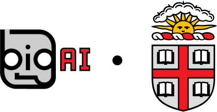

pomdp_py Documentation
======================

Overview
--------
pomdp_py is a **general purpose POMDP library** written in Python and Cython. It features simple and comprehensive interfaces to describe POMDP or MDP problems. Originally written to support POMDP planning research, the interfaces also allow extensions to model-free or model-based learning in (PO)MDPs, multi-agent POMDP planning/learning, and task transfer or transfer learning.

POMDP stands for **P**\ artially **O**\ bservable **M**\ arkov **D**\ ecision **P**\ rocess :cite:`kaelbling1998planning`.

Getting Started
---------------
* :doc:`installation`
* :doc:`examples`
* :doc:`simple_rl_integration`

Further
-------
* :doc:`design_principles`
* :doc:`existing_solvers`
* :doc:`extensions`

.. toctree::
   :maxdepth: 2
   :hidden:

   self
   getting_started

API References
--------------
.. toctree::
   :maxdepth: 3

   api/modules

Tools
-----
* :ref:`genindex`
* :ref:`modindex`
* :ref:`search`

.. bibliography:: refs.bib
   :filter: docname in docnames
   :style: unsrt

