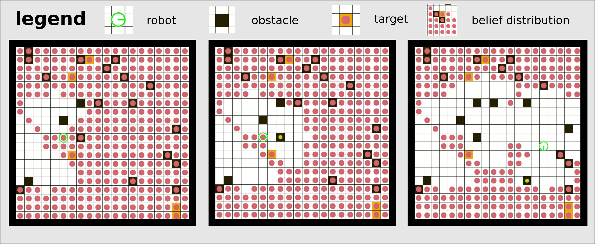

Multi-Object Search (MOS)
*************************

The purpose of this example is to **introduce the conventions** when building a project that involves a more complicated POMDP whose components better be separated for maintenance and readability purposes.
We will first introduce this task at relatively high level, then introduce the conventions of the project structure. The conventions can help you organize your project, make the code more readable, and share components between different POMDPs.  

* :ref:`overview`
* :ref:`conventions`
* :ref:`try-it`

.. _overview:

Problem overview
----------------

This task was introduced in Wandzel et al. :cite:`wandzel2019multi`. We provide a slightly different implementation without considering rooms or topological graph.

The problem is formulated as an Object-Oriented POMDP (OO-POMDP). As in the paper, we implemented this task as an OO-POMDP; `pomdp_py` provides necessary interfaces to describe an OO-POMDP (see :py:mod:`pomdp_py.framework.oopomdp` module).

In our implementation, an agent searches for :math:`n` objects
in a :math:`W` by :math:`L` gridworld. Both the agent and the
objects are represented by single grid cells. The agent can take
three categories of actions:

* Motion: moves the robot.
* Look: projects a sensing region and receives an observation.
* Find: marks objects within the sensing region as `found`.

The sensing region has a fan-shape; Our implementation allows adjusting the angle of the fan as well as sensing range. It is implemented based on a laser scanner model. When the angle is set to 360 degrees, the sensor projects a disk-shape sensing region. Occlusion (i.e. blocking of laser scan beams) is implemented, but there are artifacts due to discretization of the search space.

The transition, observation and reward models are implemented according to the original paper.

In the figure above, screenshots of frames in a run of the MOS task implemented in `pomdp_py` are shown. The solver is :py:mod:`~pomdp_py.algorithms.po_uct.POUCT`. From the first to the second image, the robot takes `Look` action and projects a fan-shaped sensing region. This leads to belief update (i.e. clearing of the red circles). A perfect observation model is used in this example run. The third image shows a later frame.

.. _conventions:

Implementing this POMDP: Conventions
------------------------------------

As described in the `Summary <examples.tiger.html#Summary>`_ section of
:doc:`examples.tiger`, the procedure of using `pomdp_py` to implement a POMDP problem is:

1. :ref:`define-the-domain`
2. :ref:`define-the-models`
3. :ref:`instantiate`
4. :ref:`solve`

In a more complicated problem like MOS, it is not good for code maintenance if we squeeze everything into a single giant file. Also, we might want to extend this problem or reuse the models on a different POMDP. Thus, we should be more organized in the code base. Below we provide a recommendation of the package structure to use `pomdp_py` in this situation. You are free to do whatever you want, but following this convention may save you time.

The package structure (for our MOS implementation) is as follows:

.. code-block:: text
   :emphasize-lines: 1,6,15,19,23

    ├── domain
    │   ├── state.py
    │   ├── action.py
    │   ├── observation.py
    │   └── __init__.py
    ├── models
    │   ├── transition_model.py    
    │   ├── observation_model.py
    │   ├── reward_model.py    
    │   ├── policy_model.py    
    │   ├── components
    │   │   ├── grid_map.py
    │   │   └── sensor.py
    │   └── __init__.py
    ├── agent
    │   ├── agent.py
    │   ├── belief.py
    │   └── __init__.py
    ├── env
    │   ├── env.py
    │   ├── visual.py
    │   └── __init__.py
    ├── problem.py
    ├── example_worlds.py    
    └── __init__.py

The recommendation is to separate code for `domain`, `models`, `agent` and `environment`, and have simple generic filenames.
As in the above package tree, files such as :code:`state.py` or
:code:`transition_model.py` are self-evident in their role. The
:code:`problem.py` file is where the
:py:mod:`~pomdp_problems.multi_object_search.problem.MosOOPOMDP` class is defined, and
where the logic of `action-feedback loop` is implemented (see
:doc:`examples.tiger` for more detail).

.. _try-it:

Try it
------

To try out the MOS example problem:

.. code-block:: shell

   $ python -m pomdp_problems.multi_object_search.problem

A gridworld with randomly placed obstacles, targets and robot initial pose is generated; The robot is equipped with either a disk-shape sensor or a laser sensor `[source] <_modules/problems/multi_object_search/problem.html#unittest>`_. A command-line interface is not yet provided; Check :py:mod:`~problems.multi_object_search.env.env.interpret`,
:py:mod:`~pomdp_problems.multi_object_search.env.env.equip_sensors`,
:py:mod:`~pomdp_problems.multi_object_search.env.env.make_laser_sensor`,
:py:mod:`~pomdp_problems.multi_object_search.env.env.make_proximity_sensor`
as well as previously linked source code
for details about how to create your custom instance of the problem.
    
.. bibliography:: refs.bib
   :filter: docname in docnames
   :style: unsrt

