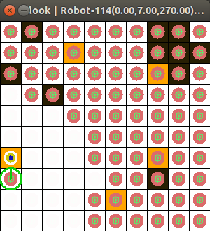

Installation
============

We recommend using `virtualenv <https://virtualenv.pypa.io/en/latest/>`_ and `pip <https://pip.pypa.io/en/stable/installing/>`_ to manage package versions and installation.

.. contents:: **Table of Contents**
   :local:
   :depth: 1

Pre-installation
----------------

1. install Python 3.7+ from `official website <https://www.python.org/downloads/>`_.

2. Install Graphviz, following `these official instructions <https://graphviz.org/download/>`_ (Optional for visualizing search tree)

Install pomdp-py
----------------

Install `pomdp-py` by::

    pip install pomdp-py

.. _install_dev:

| **Install as developer**

1. Install Cython::

    pip install Cython

2. Download `pomdp-py` latest release `on github <https://github.com/h2r/pomdp-py/releases>`_, or clone the repository by::

    git clone https://github.com/h2r/pomdp-py.git

3. Go to the package root directory (where :code:`setup.py` is located). Run::

    pip install -e .

   This will build and install `pomdp_py` package. This will build :code:`.so` files and copy them to the python source directory.  When you make changes to :code:`.pyx` or :code:`.pyd` files, run the following to rebuild those :code:`.so` libraries, so that the python imports can get those changes you made::

     make build

Test things out
---------------

Verify that **Tiger**, **RockSample**, and **Multi-Object Search** problems work::

     python -m pomdp_problems.tiger.tiger_problem
     python -m pomdp_problems.rocksample.rocksample_problem
     python -m pomdp_problems.multi_object_search.problem

For the **Tiger** problem, you should see output like

.. code-block:: text

    ** Testing value iteration **
    ==== Step 1 ====
    True state: tiger-left
    Belief: [(State(tiger-right), 0.5), (State(tiger-left), 0.5)]
    Action: listen
    Reward: -1
    >> Observation: tiger-left
    ...

There will be plots that visualize the MCTS trees displayed, like below (could be more messy):

For the **RockSample** problem, you should see something like::

    *** Testing POMCP ***
    ==== Step 1 ====
    Particle reinvigoration for 66 particles
    True state: State((0, 4) | ('bad', 'good', 'bad', 'good', 'good') | False)
    Action: sample
    Observation: None
    Reward: 0.0
    Reward (Cumulative): 0.0
    Reward (Cumulative Discounted): 0.0
    __num_sims__: 1217
    World:

    ______ID______
    .....>
    4....>
    ..210>
    .3...>
    R....>
    _____G/B_____
    .....>
    $....>
    ..x$x>
    .$...>
    R....>

For **Multi-Object Search**, you should see a plot like below,

and the agent (a green circle) starts acting:

.. code-block:: text

    $ python -m pomdp_problems.multi_object_search.problem
    pygame 1.9.6
    Hello from the pygame community. https://www.pygame.org/contribute.html
    ==== Step 1 ====
    Action: move-xyth-North
    Observation: MosOOObservation({})
    Reward: -2
    Reward (Cumulative): -2
    Find Actions Count: 0
    __num_sims__: 542
    ==== Step 2 ====
    Action: look
    Observation: MosOOObservation({3: None, 8: None, 11: (0, 6), 12: None, 14: None})
    Reward: -1
    Reward (Cumulative): -3
    Find Actions Count: 0
    __num_sims__: 506
    ...

Docker image
------------
Instructions for using `pomdp_py` via `Docker can be found here <https://hub.docker.com/r/romainegele/pomdp>`_ on Docker Hub.

Credit: `Romain Egele <https://github.com/Deathn0t>`_
