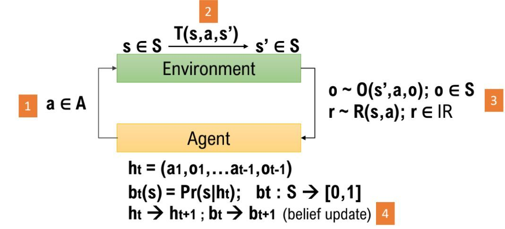

pomdp_py Documentation
======================

pomdp_py is a **general purpose POMDP library** written in Python and Cython. It features simple and comprehensive interfaces to describe POMDP or MDP problems. Originally written to support POMDP planning research, the interfaces also allow extensions to model-free or model-based learning in (PO)MDPs, multi-agent POMDP planning/learning, and task transfer or transfer learning.

POMDP stands for **P**\ artially **O**\ bservable **M**\ arkov **D**\ ecision **P**\ rocess :cite:`kaelbling1998planning`.

   A Diagram for POMDP :math:`\langle S,A,\Omega,T,O,R \rangle`. (**error**:
   change :math:`o\in S` to :math:`o\in\Omega`)
   

Design Principles
#################
1. Distributions are the fundamental building blocks of a POMDP.

   Essentially, a POMDP describes the interaction between an `agent` and the
   `environment`.  The interaction is formally encapsulated by a few important
   `generative probability distributions`. The core of pomdp_py is built around
   this understanding. The interfaces in :py:mod:`pomdp_py.framework.basics`
   convey this idea.

--

2. POMDP = agent + environment

   Like above, the gist of a POMDP is captured by the generative probability
   distributions including the
   :class:`~pomdp_py.framework.basics.TransitionModel`,
   :class:`~pomdp_py.framework.basics.ObservationModel`,
   :class:`~pomdp_py.framework.basics.RewardModel`. Because, generally, T, R, O
   may be different for the agent versus the environment (to support learning),
   it does not make much sense to have the POMDP class to hold this information;
   instead, Agent should have its own T, R, O, pi and the Environment should
   have its own T, R. The job of a POMDP is only to verify whether a given
   state, action, or observation are valid. See :class:`~pomdp_py.framework.basics.Agent`
   and :class:`~pomdp_py.framework.basics.Environment`.

Existing POMDP Solvers
######################
The library currently contains an implementation of `POMCP`, `POUCT`, and basic `ValueIteration`.

Natural Extensions
##################
The interfaces provided by pomdp_py should support projects in these directions (and more):

1. POMDP for RL (Reinforcement Learning)

   - Learn a :class:`~pomdp_py.framework.basics.PolicyModel` (model-free)

   - Learn a :class:`~pomdp_py.framework.basics.TransitionModel` and
     :class:`~pomdp_py.framework.basics.ObservationModel` (model-based)

2. Multi-Agent POMDPs

   - Define multiple :class:`~pomdp_py.framework.basics.Agent` classes.

3. Object-Oriented POMDPs

   - The Object-Oriented POMDP (OO-POMDP) already has its interfaces implemented
     in :py:mod:`~pomdp_py.framework.oopomdp`.

3. Task Transfer or Transfer Learning

   - Define multiple :class:`~pomdp_py.framework.basics.Agent` classes.

3. Planning Algorithm Research

   - Use existing POMCP or POUCT as baslines.
   

Full API Reference
##################  
.. toctree::
   :maxdepth: 4

   api/modules
   
           
More
----

* :ref:`genindex`
* :ref:`modindex`
* :ref:`search`

.. bibliography:: refs.bib
   :style: unsrt

